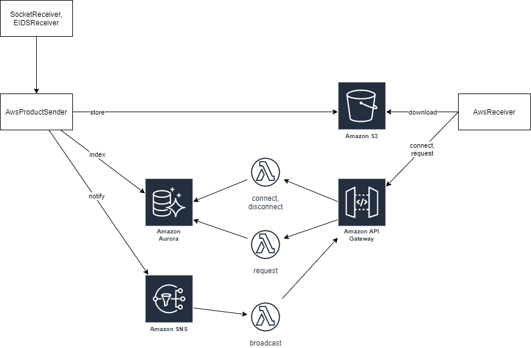
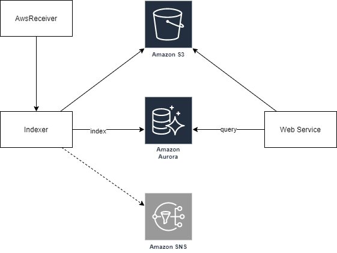

# ComCat into the cloud.

Store product contents in S3, send notifications using SNS and web sockets, and
store Product and Event Index in Aurora. Run PDL, Indexer, and Web Service on
EC2s.

## Hub

One Hub PDL client runs various receiver and verifies signatures. The hub uses
an **AwsProductSender** that: stores products in S3, indexes product information
in a new (product-only) Product Index in Aurora, and sends a notification to an
SNS topic.

Products stored in S3 include S3 urls for contents. Notifications include an S3
to download the product, and contents do not need to be downloaded; but in the
short term that will remain unchanged.

Clients receive notifications via a web socket protocol, connecting through API
Gateway. When clients connect/disconnect, the connection id is
registered/unregistered in Aurora. A broadcast lambda function broadcasts
notifications to all registered clients.

Clients track the created time for the most recent notification, and when
starting can request notifications that occurred after that (or a default) time.
Clients may receive broadcasts during this time, but ignore them until they have
caught up to the present; at which point they stop requesting notifications and
start processing broadcasts. In theory clients could request all products.

## Indexer and Web Service

One ComCat Indexer PDL client runs an **AwsReceiver** to process notifications
sent via SNS. The indexer is configured with an S3ProductStorage, which already
has every product. During processing, the indexer attempts to store the product
and will get a ProductAlreadyInStorageException and will index the product as
long as it hasn't already been indexed. The event index is managed in an Aurora
database (the same as the Hub).

Multiple Web Service EC2s (hazdev-webapps?) run the earthquake-event-ws
application, connecting to the aurora database for queries, and S3ProductStorage
using S3FS for product details.

## Future development

- FileProductStorage should add an option to not download non-file-protocol URL
  contents. The realtime feeds could enable this to stop downloading contents
  from S3.

- Implement new PDL protocol to upload contents directly to S3 using signed
  urls.

- Update the web service to use the new (product-only) product index, which will
  include content information

- Broadcast indexer change notifications to SNS and web sockets similar to the
  hub.
